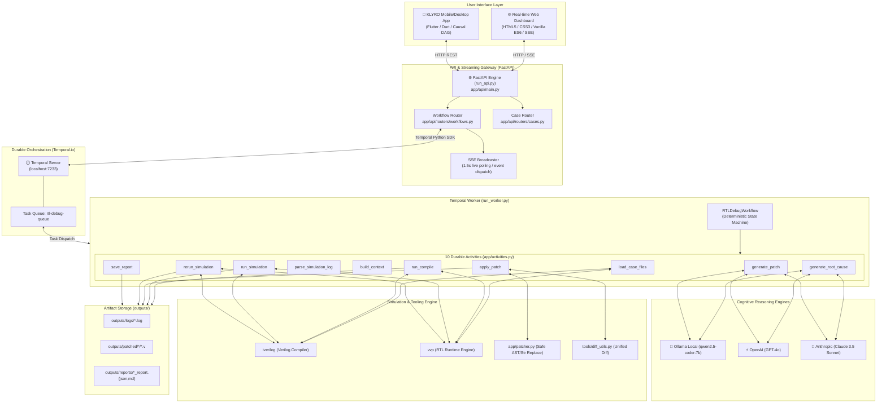
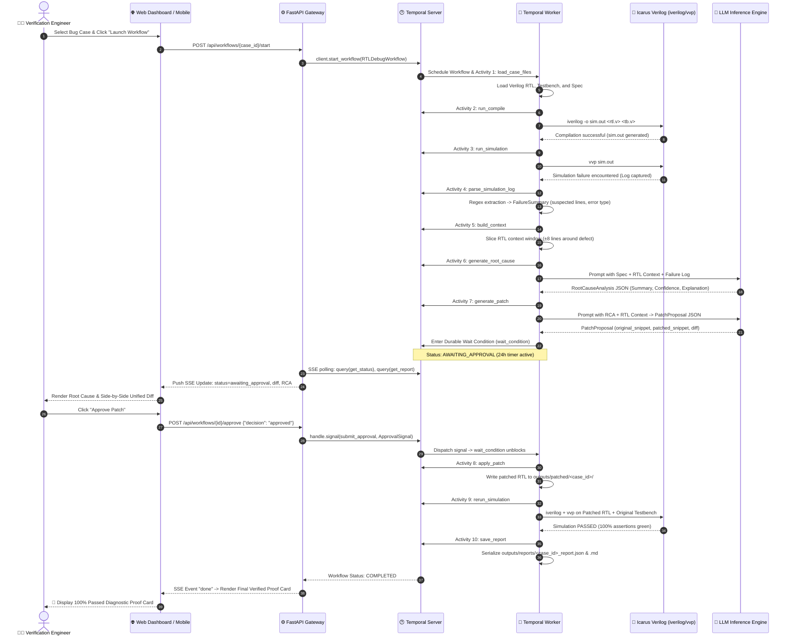
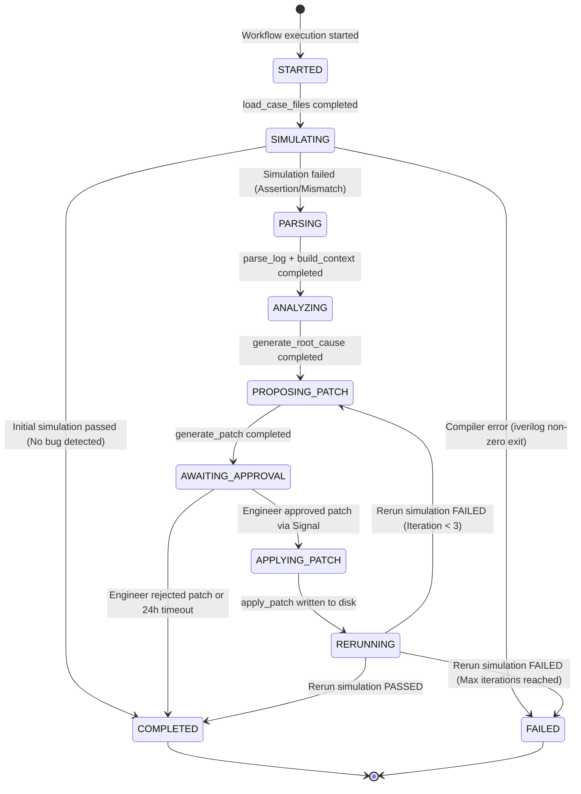
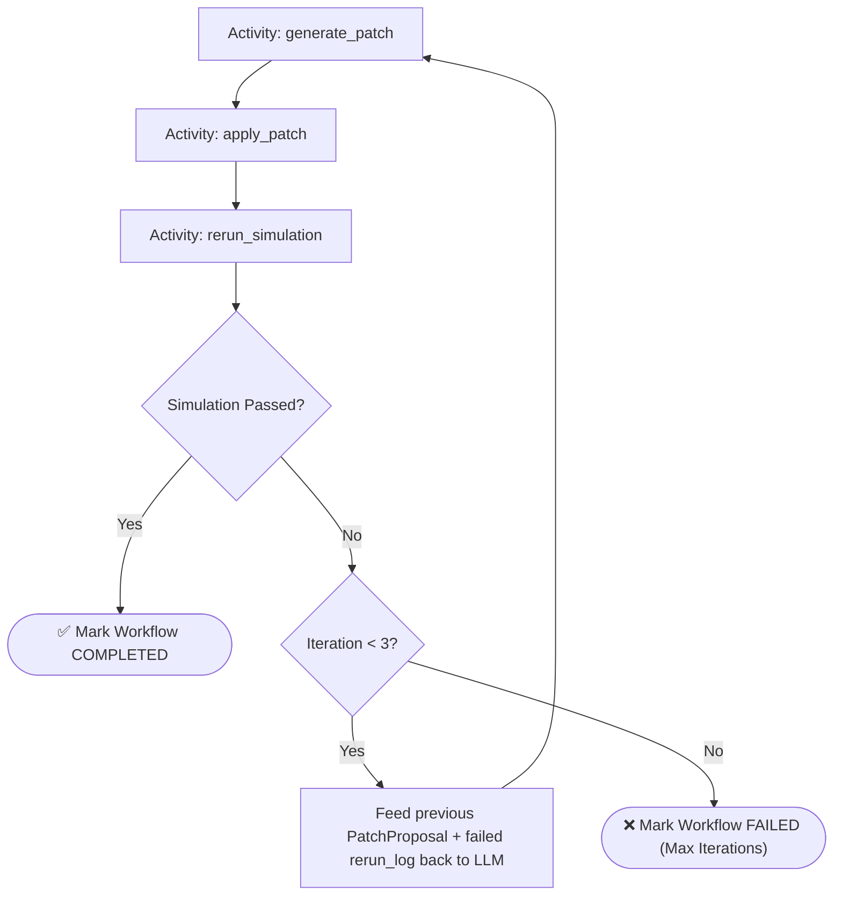
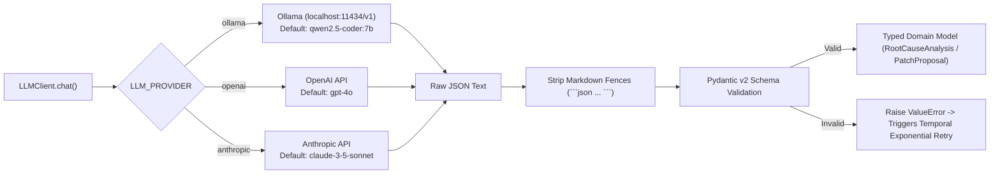
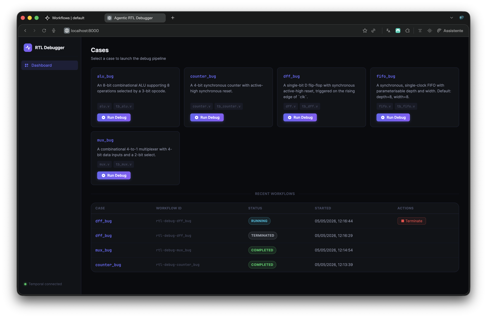
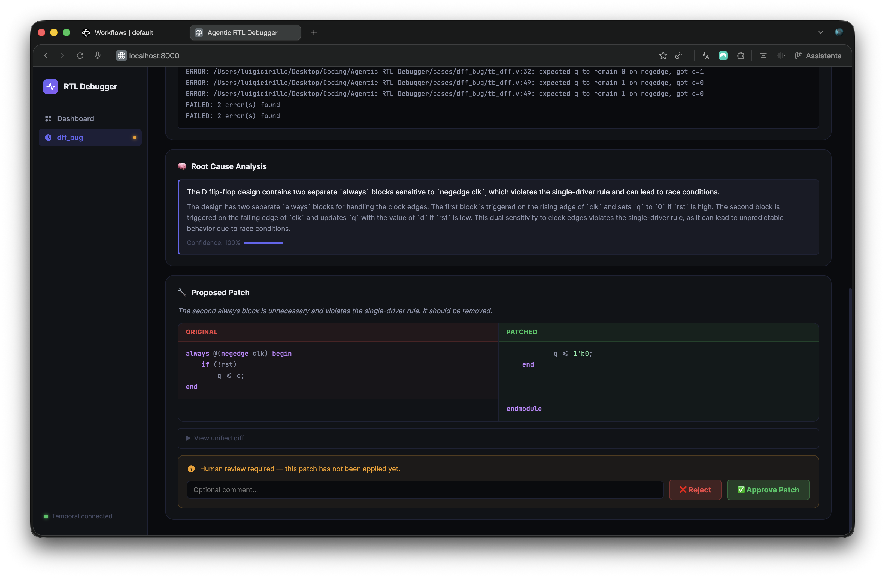
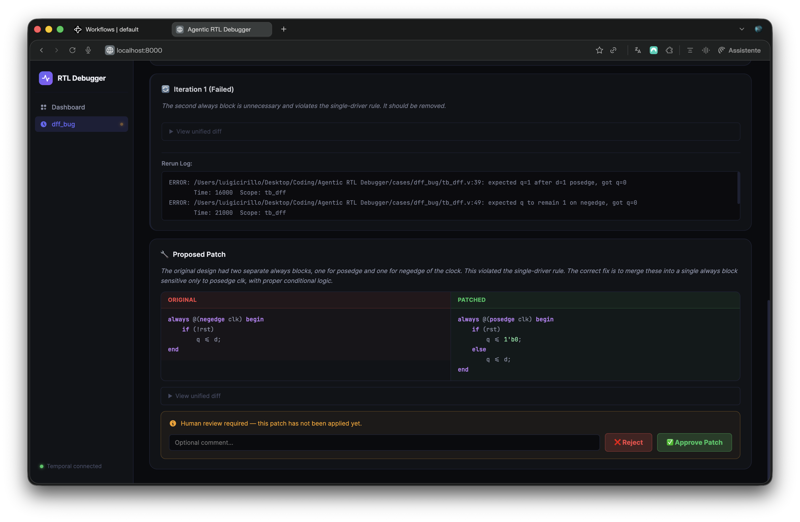
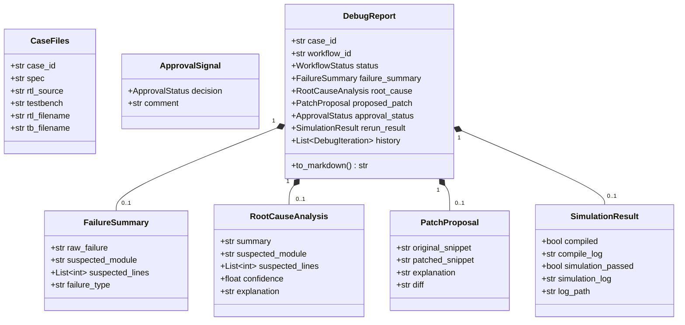

# ⚡ KLYRO — Autonomous Hardware & Software Diagnostic Intelligence System

<div align="center">


<br/>

> **"AI proposes. Tools prove."**  
> *"Don't guess the bug. Prove the cause."*

**KLYRO** is an enterprise-grade, agentic diagnostic intelligence platform and autonomous debugging orchestrator for complex hardware (Verilog RTL) and software systems. It combines **Temporal durable workflows**, **multi-provider LLM reasoning (local Ollama / OpenAI / Anthropic)**, **deterministic compiler & simulator toolchains**, and **human-in-the-loop governance** to isolate failures, compute root causes, synthesize validated patches, and prove repairs through automated test re-execution.

</div>

---

## 🌿 Repository Architecture & Branch Guide

This repository uses a clean **multi-branch architecture**. The default branch serves as the central **Master Architecture & Documentation Hub**, while complete implementation codebases are maintained on their dedicated branches:

| Branch | Component | Description | Quick Switch |
|---|---|---|---|
| **`app`** *(Default)* | 📖 **Architecture Hub** | Master system architecture, design specifications, sequence diagrams, and API schemas. | `git checkout app` |
| **`rtl-debugger`** | ⚙️ **Python Backend Engine** | Temporal durable workflow orchestrator, Activities, Icarus Verilog runner, multi-provider LLM client (Ollama/OpenAI/Anthropic), FastAPI REST/SSE server, and Web dashboard. | `git checkout rtl-debugger` |
| **`flutter-app`** | 📱 **Mobile Diagnostic Client** | 14-screen Flutter mobile & desktop diagnostic intelligence app, Causal DAG graph, audio waveform capture, Git blame correlation, and Proof Card generator. | `git checkout flutter-app` |

---

## 📑 Table of Contents

- [1. Executive Overview](#1-executive-overview)
- [2. System Architecture](#2-system-architecture)
  - [2.1 High-Level Architecture](#21-high-level-architecture)
  - [2.2 Complete End-to-End System Topology](#22-complete-end-to-end-system-topology)
- [3. Core Subsystems & Components](#3-core-subsystems--components)
  - [3.1 Temporal Durable Orchestration Engine](#31-temporal-durable-orchestration-engine)
  - [3.2 Workflow State Machine & Lifecycle](#32-workflow-state-machine--lifecycle)
  - [3.3 10-Phase Activity Pipeline](#33-10-phase-activity-pipeline)
  - [3.4 Human-in-the-Loop Approval Gate](#34-human-in-the-loop-approval-gate)
  - [3.5 Agentic Feedback & Self-Correction Loop](#35-agentic-feedback--self-correction-loop)
  - [3.6 LLM Reasoning Engine (Multi-Provider)](#36-llm-reasoning-engine-multi-provider)
  - [3.7 Hardware Simulation & Tooling Layer](#37-hardware-simulation--tooling-layer)
  - [3.8 FastAPI REST & Server-Sent Events (SSE) Gateway](#38-fastapi-rest--server-sent-events-sse-gateway)
- [4. User Interfaces & Dashboards](#4-user-interfaces--dashboards)
  - [4.1 Real-Time Web Live Dashboard](#41-real-time-web-live-dashboard)
  - [4.2 KLYRO Mobile/Desktop Flutter Diagnostic Client (14 Screens)](#42-klyro-mobiledesktop-flutter-diagnostic-client-14-screens)
- [5. Diagnostic Scenarios & Bug Suite](#5-diagnostic-scenarios--bug-suite)
- [6. Directory & File Structure](#6-directory--file-structure)
- [7. Data Models & Schemas](#7-data-models--schemas)
- [8. API Specification](#8-api-specification)
- [9. Installation & Setup Guide](#9-installation--setup-guide)
- [10. Execution & Operation Guide](#10-execution--operation-guide)
- [11. Environment Configuration](#11-environment-configuration)
- [12. Design Philosophy & Future Roadmap](#12-design-philosophy--future-roadmap)

---

## 1. Executive Overview

Modern hardware and software verification workflows suffer from high cognitive overhead: engineers spend hours reading verbose simulator logs, correlating stack traces with version control, manually isolating suspect lines, and hypothesizing fixes. 

Standard LLM code assistants fail at this task because:
1. **Lack of Durability**: Ephemeral scripts lose execution state on server crashes or timeouts.
2. **Hallucinated Patches**: AI generates code that looks plausible but breaks simulation constraints or fails compilation.
3. **No Tool-Grounded Verification**: AI suggestions are rarely tested in an isolated sandbox with automated pass/fail verification before presentation.
4. **Ungoverned Execution**: Applying automated patches directly to source control without human approval introduces dangerous regressions.

### The KLYRO Solution

KLYRO solves these challenges by establishing a **closed-loop, tool-verified, durable debugging pipeline**:

```
┌─────────────────────────────────────────────────────────────────────────────┐
│                             THE KLYRO PIPELINE                              │
│                                                                             │
│  [Hardware/Software]       [Deterministic Tools]        [Multi-Provider LLM] │
│      Failing RTL      ───►   iverilog / vvp      ───►     Root Cause RCA    │
│     & Testbench               Simulation                  & Patch Proposal  │
│                                                                  │          │
│  [Verified Pass/Fail]       [Durable Gate]                       │          │
│   Proof Card & Report ◄───  Human Approval  ◄────────────────────┘          │
│                             (Signal / SSE)                                  │
└─────────────────────────────────────────────────────────────────────────────┘
```

- **100% Durable**: Backed by Temporal.io, the debugging state machine can pause for hours or days waiting for engineer review, surviving node restarts without state loss.
- **Local-First & Privacy-Preserving**: Defaults to local Ollama inference (`qwen2.5-coder:7b`) with zero proprietary data leaving the on-premise perimeter.
- **Human-in-the-Loop (HITL)**: Cryptographically reliable signal gates prevent any code modification without explicit engineer sign-off.
- **Automated Sandbox Verification**: Every approved patch is applied in an isolated workspace, recompiled, and re-simulated against strict testbench assertions before closing the incident.

---

## 2. System Architecture

### 2.1 High-Level Architecture

KLYRO separates **Deterministic Orchestration** (Temporal Workflow), **Non-Deterministic Side-Effects** (Temporal Activities), **Simulation Tooling** (Icarus Verilog), **Inference Engines** (Ollama / OpenAI / Anthropic), and **Interactive Frontends** (Web SSE Dashboard & Flutter Diagnostic App).



---

### 2.2 Complete End-to-End System Topology



---

## 3. Core Subsystems & Components

### 3.1 Temporal Durable Orchestration Engine

The backbone of KLYRO is built upon **Temporal.io**, ensuring deterministic workflow execution, fault tolerance, and zero state loss.

#### Strict Determinism Contract
Temporal enforces a strict boundary between workflow orchestration and activity execution:
- **Workflow Code (`app/workflows.py`)**: Pure, deterministic Python. No network I/O, no filesystem modifications, no subprocess invocations, and no unseeded random numbers. Workflows define the control graph, sequence activities, evaluate signals, and expose query endpoints.
- **Activity Code (`app/activities.py`)**: Non-deterministic execution units. All side effects—such as invoking `iverilog`, sending HTTP payloads to Ollama/OpenAI/Anthropic, parsing files, writing patches, and compiling markdown reports—occur strictly within activities.

```
┌──────────────────────────────────────────────────────────────────────────┐
│                           DURABILITY GUARANTEE                           │
│                                                                          │
│  If the worker process crashes, machine reboots, or network drops:       │
│  1. Temporal reconstructs workflow state by replaying event history.     │
│  2. Completed activities are NOT re-executed (results cached in event). │
│  3. The workflow resumes seamlessly at the exact point of interruption.  │
└──────────────────────────────────────────────────────────────────────────┘
```

---

### 3.2 Workflow State Machine & Lifecycle

The workflow transitions through deterministic states managed by `WorkflowStatus`:



---

### 3.3 10-Phase Activity Pipeline

Every activity is isolated, typed with Pydantic v2 schemas, and wrapped with Temporal activity definitions:

| Phase | Activity Name | Input | Output | Description |
|---|---|---|---|---|
| **Phase 1** | `load_case_files` | `case_id: str` | `CaseFiles` | Loads `<module>.v`, `tb_<module>.v`, and `spec.md` from `cases/<case_id>/`. |
| **Phase 2** | `run_compile` | `CaseFiles` | `SimulationResult` | Runs `iverilog` to produce the compiled simulation binary `sim.out`. |
| **Phase 3** | `run_simulation` | `CaseFiles` | `SimulationResult` | Executes `vvp sim.out` and captures simulation stdout, stderr, and failure signals. |
| **Phase 4** | `parse_simulation_log` | `SimulationResult` | `FailureSummary` | Regex engine extracts failing timestamps, offending modules, and suspect line numbers. |
| **Phase 5** | `build_context` | `(CaseFiles, FailureSummary)` | `str` | Extracts a focused ±8 line code window around the suspect lines with line numbers. |
| **Phase 6** | `generate_root_cause` | `(CaseFiles, FailureSummary, ctx)` | `RootCauseAnalysis` | Invokes LLM with system prompts to deduce bug classification, reasoning, and confidence. |
| **Phase 7** | `generate_patch` | `(CaseFiles, RCA, SimRes, prev, ctx)` | `PatchProposal` | Prompts LLM for targeted code substitution, computes unified diff, and pre-validates. |
| **Phase 8** | `apply_patch` | `(CaseFiles, PatchProposal)` | `None` | Safely modifies the RTL code and saves output to `outputs/patched/<case_id>/`. |
| **Phase 9** | `rerun_simulation` | `CaseFiles` | `SimulationResult` | Compiles patched RTL with original testbench and verifies complete assertion pass. |
| **Phase 10** | `save_report` | `DebugReport` | `None` | Serializes comprehensive JSON & human-readable Markdown reports to `outputs/reports/`. |

---

### 3.4 Human-in-the-Loop Approval Gate

KLYRO enforces a strict security policy: **No AI-generated patch is ever executed against verified hardware designs without human approval.**

```python
# app/workflows.py — Durable pause mechanism
await workflow.wait_condition(
    lambda: self._approval is not None,
    timeout=timedelta(hours=24),
)
```

- **Non-Blocking Durability**: The worker releases compute resources while awaiting human input.
- **Signal Dispatch**: Approved or rejected via REST API or CLI:
  ```python
  @workflow.signal
  async def submit_approval(self, signal: ApprovalSignal) -> None:
      self._approval = signal
  ```
- **Queryable Inspection**: Live status and partial reports remain queryable throughout the wait state:
  ```python
  @workflow.query
  def get_status(self) -> str:
      return self._status.value

  @workflow.query
  def get_report(self) -> Optional[dict]:
      return self._report.model_dump() if self._report else None
  ```

---

### 3.5 Agentic Feedback & Self-Correction Loop

If an approved patch fails post-application simulation, KLYRO does not abort immediately. Instead, it activates an **Agentic Feedback Loop**:



1. The failed simulation log and previous incorrect patch snippet are fed back into the `generate_patch` prompt.
2. The LLM performs self-correction reasoning on why the previous patch failed.
3. Up to 3 autonomous iterations are executed before escalating to the engineer.

---

### 3.6 LLM Reasoning Engine (Multi-Provider)

KLYRO features an async multi-provider LLM abstraction layer (`app/llm_client.py`):



#### Supported Providers & Models

| Provider | Config Identifier | Default Model | Best For |
|---|---|---|---|
| **Ollama** *(Recommended)* | `ollama` | `qwen2.5-coder:7b` | Local, air-gapped, zero-cost, privacy-preserving RTL reasoning |
| **OpenAI** | `openai` | `gpt-4o` | High-complexity multi-module digital logic synthesis |
| **Anthropic** | `anthropic` | `claude-3-5-sonnet-20241022` | Deep context analysis and complex specification alignment |

---

### 3.7 Hardware Simulation & Tooling Layer

- **Icarus Verilog (`iverilog`)**: Compiles IEEE-1364 Verilog RTL designs and testbenches into native binary simulation files.
- **VVP Runtime (`vvp`)**: Simulates the compiled design, enforcing clock cycle timing, driving test vectors, evaluating assertions, and dumping VCD waveforms.
- **Log Parser (`app/log_parser.py`)**: Uses regex patterns to identify failure semantics (e.g., `ERROR`, `FATAL`, `mismatch`, line numbers, module hierarchies).
- **Context Builder (`app/context_builder.py`)**: Extracts an active code window around the defect site while maintaining syntax boundaries.
- **Safe AST Patcher (`app/patcher.py`)**: Performs exact code replacement with collision checks, preventing malformed patch application.
- **Diff Utility (`tools/diff_utils.py`)**: Computes standardized unified diffs with line-by-line additions and deletions.

---

### 3.8 FastAPI REST & Server-Sent Events (SSE) Gateway

The API layer (`app/api/main.py`) exposes high-performance asynchronous endpoints:
- **Temporal Client Lifecycle Management**: Single persistent connection pool established during FastAPI lifespan startup.
- **Server-Sent Events (SSE)**: Streams live workflow progress every 1.5 seconds directly to the browser, eliminating unnecessary polling.
- **Dual-Mode Status Discovery**: Dynamically resolves workflow states from active Temporal memory or reads persisted disk reports (`outputs/reports/`) for archived runs.

---

## 4. User Interfaces & Dashboards

### 4.1 Real-Time Web Live Dashboard

The web dashboard (`web/index.html`, `web/assets/app.js`, `web/assets/style.css`) provides a complete operations console:

<div align="center">

| Case Selection Catalog | Live Pipeline Visualizer |
|:---:|:---:|
|  |  |
| **Interactive Human Approval Gate** | **Agentic Feedback Loop** |
|  |  |

</div>

#### Key Dashboard Capabilities
- **Case Discovery Catalog**: Browse pre-configured RTL verification cases with instant one-click launch.
- **Live Pipeline Tracker**: 9-stage visual progress tracker (Load → Simulate → Parse → Analyze → Patch → Review → Apply → Verify → Done).
- **Interactive Diff Viewer**: Side-by-side syntax comparison with green/red line highlighting.
- **Approval Console**: Modal dialog for single-click patch acceptance or rejection with optional feedback comments.

---

### 4.2 KLYRO Mobile/Desktop Flutter Diagnostic Client (14 Screens)

For on-the-go triage and hardware-lab companion usage, KLYRO provides a **14-Screen Phone-First Diagnostic Intelligence App** (`lib/`):

```
┌─────────────────────────────────────────────────────────────────────────────┐
│                    14-SCREEN DIAGNOSTIC FLOW ARCHITECTURE                   │
│                                                                             │
│  [01. HOME] ──────────► [02. CAPTURE] ──────────► [03. ANALYZING]           │
│       │                        │                         │                  │
│       ▼                        ▼                         ▼                  │
│  [06. EVIDENCE] ◄───── [05. ROOT CAUSE] ◄────── [04. INVESTIGATE]           │
│       │ (Drilldowns)                                                        │
│       ├─► [07. SOURCE CODE]   (Syntax viewer with ⚠ Suspicious flag)       │
│       ├─► [08. GIT BLAME]     (Commit correlation & blame analysis)        │
│       └─► [09. DAG GRAPH]     (Interactive Causal DAG)                     │
│       │                                                                     │
│       ▼                                                                     │
│  [10. PATCH REVIEW] ──► [11. APPROVAL GATE] ───► [12. OFFICE KIT]           │
│                                 │                         │                 │
│                                 ▼                         ▼                 │
│                       [14. PROOF CARD] ◄──────── [13. VERIFICATION]         │
└─────────────────────────────────────────────────────────────────────────────┘
```

#### Detailed Screen Breakdown
1. **Screen 01 — Home**: Active incident feed, local intelligence status (`⚡ KLYRO ◉ LOCAL`), and quick incident initiation.
2. **Screen 02 — Capture**: Multi-modal failure intake (Screenshot, Paste Log, Camera OCR, Voice Audio Waveform recording).
3. **Screen 03 — Analysis Loading**: Progressive diagnostic pipeline animation (`Failure parsed` → `Stack trace analyzed` → `Repository indexed` → `Git correlated` → `Dependency path built` → `Generating hypotheses`).
4. **Screen 04 — Investigate**: Ranked competing hypotheses with confidence scoring and heuristic breakdowns (Stack trace +30, Dependency path +20, Recent change +20).
5. **Screen 05 — Root Cause (Signature Screen)**: Definitive root cause summary, 90%+ confidence gauge, failure path DAG, and corroborating signal tallies.
6. **Screen 06 — Evidence**: Expandable corroborating signal cards with drilldown shortcuts.
7. **Screen 07 — Source Evidence**: Syntax-highlighted code viewer displaying `alu.v` / `fifo.v` / `TokenCache.kt` with floating `⚠ Suspicious` callouts.
8. **Screen 08 — Git Evidence**: Commit history correlation (`a81c2d1`, `c4e9102`), author tracking, and diff breakdown.
9. **Screen 09 — Evidence Graph**: Interactive Causal DAG graph with semantic node colors:
   - 🔴 **Red**: Failure Point
   - 🟡 **Amber**: Suspect Hypothesis
   - 🟢 **Green**: Corroborating Tool Evidence
   - 🟣 **Purple**: AI Deductive Reasoning
10. **Screen 10 — Patch Review**: Unified code diff viewer (-/+ line highlighting), risk classification (`LOW`), and affected files.
11. **Screen 11 — Approval Gate**: Formal biometric / slider confirmation gate before executing code modification.
12. **Screen 12 — Office Kit**: Dual-surface companion view showing laptop repository indexing, test runner readiness, and live sync timeline.
13. **Screen 13 — Verification**: Test harness execution (`iverilog simulation` / `./gradlew test`), Before (✕ FAILED) vs After (✓ PASSED 100%) comparison.
14. **Screen 14 — Proof Card**: Final hero summary card with one-tap export, share, and markdown report generator.

---

## 5. Diagnostic Scenarios & Bug Suite

KLYRO ships with a comprehensive benchmark suite of hardware RTL defects and software incidents:

| Case ID | Module | Category | Defect Description | Injected Root Cause |
|---|---|---|---|---|
| `counter_bug` | `counter.v` | Hardware RTL | 4-Bit Synchronous Counter | Missing `else` branch in synchronous reset logic; counter fails to increment when reset is low. |
| `alu_bug` | `alu.v` | Hardware RTL | Arithmetic Logic Unit | Incorrect subtraction encoding (`result = a + (~b)` missing `+ 1` two's complement carry-in). |
| `dff_bug` | `dff.v` | Hardware RTL | D Flip-Flop | Inverted clock sensitivity list (`negedge clk` instead of `posedge clk`). |
| `mux_bug` | `mux.v` | Hardware RTL | 4-to-1 Multiplexer | Off-by-one error in select decode logic (`2'b11` maps to invalid input). |
| `fifo_bug` | `fifo.v` | Hardware RTL | Synchronous FIFO | Pointer wrap-around defect; 3-bit pointers fail to distinguish between Full and Empty states. |
| `INC-2026-001` | `TokenCache.kt` | Mobile / Cloud | Mobile Auth System | HTTP 401 Checkout Failure caused by unvalidated token cache reuse after expiry. |

---

## 6. Directory & File Structure

```
KLYRO/
├── .env.example                 # Environment configuration template
├── .gitignore                   # Git ignore rules (Python, Flutter, Temporal)
├── requirements.txt             # Python dependencies (Temporal SDK, FastAPI, etc.)
├── run_api.py                   # FastAPI server entry point
├── run_worker.py                # Temporal worker daemon entry point
├── run_starter.py               # CLI workflow execution launcher
├── run_signal.py                # CLI approval/rejection signal dispatcher
├── README.md                    # Master architectural documentation
│
├── app/                         # Python Backend Core Engine
│   ├── __init__.py
│   ├── config.py                # Pydantic env settings
│   ├── models.py                # Pydantic v2 data schemas
│   ├── workflows.py             # Deterministic Temporal workflow definition
│   ├── activities.py            # 10 Non-deterministic Temporal activities
│   ├── llm_client.py            # Multi-provider LLM client (Ollama/OpenAI/Anthropic)
│   ├── prompts.py               # Structured LLM prompt templates
│   ├── log_parser.py            # Simulation regex log parser
│   ├── context_builder.py       # Dynamic RTL context window extractor
│   ├── patcher.py               # Safe string & AST patch application
│   └── api/                     # FastAPI Routing Layer
│       ├── __init__.py
│       ├── main.py              # FastAPI app initialization & Temporal client lifecycle
│       └── routers/
│           ├── __init__.py
│           ├── cases.py         # Case discovery & source file endpoints
│           └── workflows.py     # Workflow launch, SSE stream, & signal endpoints
│
├── tools/                       # Simulation & File Utilities
│   ├── __init__.py
│   ├── simulation.py            # Async iverilog compiler & vvp runtime wrapper
│   ├── file_reader.py           # Case directory loader
│   └── diff_utils.py            # Unified diff generator
│
├── cases/                       # Pre-configured Bug Benchmark Cases
│   ├── counter_bug/             # [counter.v, tb_counter.v, spec.md, expected.md]
│   ├── alu_bug/                 # [alu.v, tb_alu.v, spec.md, expected.md]
│   ├── dff_bug/                 # [dff.v, tb_dff.v, spec.md, expected.md]
│   ├── mux_bug/                 # [mux.v, tb_mux.v, spec.md, expected.md]
│   └── fifo_bug/                # [fifo.v, tb_fifo.v, spec.md, expected.md]
│
├── web/                         # Browser Operations Dashboard
│   ├── index.html               # Single-page dashboard UI
│   └── assets/
│       ├── app.js               # Reactive SSE client & UI controller
│       └── style.css            # Dark glassmorphic design system
│
├── lib/                         # Flutter Mobile & Desktop Diagnostic Client
│   ├── main.dart                # Flutter app entry point
│   ├── controllers/             # State management & app controller
│   ├── data/                    # Mock incident models & diagnostic datasets
│   ├── models/                  # Dart domain models (Incident, Hypothesis, Patch, etc.)
│   ├── screens/                 # 14 Prototype diagnostic screens
│   ├── theme/                   # KLYRO dark mode design system & typography
│   └── widgets/                 # Causal DAG, Diff Viewer, Proof Card, Audio Wave
│
└── docs/                        # In-depth Technical Documentation
    ├── architecture.md          # Temporal workflow mechanics & state diagrams
    ├── web-architecture.md      # Web SSE & API layer mechanics
    └── images/                  # System diagrams, GIFs, and screenshots
```

---

## 7. Data Models & Schemas

All backend structures are strictly typed using **Pydantic v2**:



---

## 8. API Specification

| HTTP Method | Route Endpoint | Purpose | Description |
|---|---|---|---|
| `GET` | `/api/cases` | Case Discovery | Returns all available benchmark cases with status summaries. |
| `GET` | `/api/cases/{case_id}` | Case Details | Returns full metadata, specification, and RTL source code. |
| `GET` | `/api/cases/{case_id}/report` | Fetch Report | Retrieves the latest persisted JSON debug report from disk. |
| `GET` | `/api/workflows` | List Workflows | Returns active and recently closed Temporal workflow executions. |
| `POST` | `/api/workflows/{case_id}/start` | Launch Workflow | Initiates `RTLDebugWorkflow` for the specified `case_id`. |
| `GET` | `/api/workflows/{id}/status` | Query Status | Queries current workflow state and progressively generated report. |
| `GET` | `/api/workflows/{id}/stream` | SSE Live Stream | Server-Sent Events stream delivering real-time status and diffs. |
| `POST` | `/api/workflows/{id}/approve` | Dispatch Approval | Sends `submit_approval` signal (`approved` or `rejected`). |
| `POST` | `/api/workflows/{id}/terminate` | Kill Execution | Terminates a running Temporal workflow execution immediately. |

---

## 9. Installation & Setup Guide

### 9.1 Prerequisites

Ensure the following tools are installed on your workstation:
- **Python**: `≥ 3.11`
- **Temporal CLI**: `v1.1+` (or access to a running Temporal cluster)
- **Icarus Verilog**: `iverilog` and `vvp` available on your system `PATH`
- **LLM Engine**:
  - **Ollama** *(Recommended)*: [https://ollama.com](https://ollama.com)
  - *Or an API key for OpenAI / Anthropic*
- **Flutter SDK** *(Optional, for Mobile App)*: `≥ 3.0.0`

### 9.2 Step-by-Step Installation

```bash
# 1. Clone the repository
git clone https://github.com/GGCIRILLO/Agentic-RTL-Debugger.git KLYRO
cd KLYRO

# 2. Set up Python Virtual Environment
python3 -m venv venv
# Linux / macOS:
source venv/bin/activate
# Windows PowerShell:
# .\venv\Scripts\Activate.ps1

# 3. Install Python Dependencies
pip install -r requirements.txt

# 4. Configure Environment Variables
cp .env.example .env
# Edit .env to set your preferred LLM_PROVIDER and model settings

# 5. Pull the recommended local Ollama model
ollama pull qwen2.5-coder:7b
```

---

## 10. Execution & Operation Guide

To run the complete KLYRO platform, open **four terminal windows**:

### Terminal 1 — Start Temporal Dev Server
```bash
temporal server start-dev
```
> 💡 *Temporal Web UI will be available at [http://localhost:8233](http://localhost:8233)*

### Terminal 2 — Start Temporal Worker Daemon
```bash
source venv/bin/activate
python run_worker.py
```

### Terminal 3 — Start FastAPI & Web Dashboard Gateway
```bash
source venv/bin/activate
python run_api.py
```
> 🌐 *Open your browser to [http://localhost:8000](http://localhost:8000) to access the KLYRO Web Operations Console.*

### Terminal 4 — Launch a Debug Run (CLI Alternative)

You can launch and interact with workflows directly via CLI:

```bash
# Start a workflow run for the counter_bug case:
python run_starter.py counter_bug

# Once the LLM generates a patch, approve it via signal:
python run_signal.py rtl-debug-counter_bug approve

# Or reject it:
python run_signal.py rtl-debug-counter_bug reject
```

### Running the Flutter Mobile Diagnostic App (Optional)

```bash
# Run on Android Emulator / Physical Device:
flutter pub get
flutter run

# Run in Chrome browser:
flutter run -d chrome
```

---

## 11. Environment Configuration

All settings are configured via `.env` or system environment variables:

```env
# ==========================================
# Temporal Server Configuration
# ==========================================
TEMPORAL_HOST=localhost:7233
TEMPORAL_NAMESPACE=default
TEMPORAL_TASK_QUEUE=rtl-debug-queue

# ==========================================
# LLM Provider Configuration
# Options: "ollama" | "openai" | "anthropic"
# ==========================================
LLM_PROVIDER=ollama

# --- Ollama Settings (Local inference) ---
LLM_MODEL=qwen2.5-coder:7b
OLLAMA_BASE_URL=http://localhost:11434/v1

# --- OpenAI Settings ---
# LLM_PROVIDER=openai
# LLM_MODEL=gpt-4o
# OPENAI_API_KEY=sk-proj-...

# --- Anthropic Settings ---
# LLM_PROVIDER=anthropic
# LLM_MODEL=claude-3-5-sonnet-20241022
# ANTHROPIC_API_KEY=sk-ant-...

# ==========================================
# Path Configuration
# ==========================================
CASES_DIR=cases
OUTPUTS_DIR=outputs
```

---

## 12. Design Philosophy & Future Roadmap

### Design Philosophy
- **Tools over Hallucination**: AI is treated as a creative hypothesis generator, never as ground truth. Only deterministic compilers, formal testbenches, and hardware simulators have the authority to verify code correctness.
- **Durable by Default**: Debugging should never be fragile. Workflows must survive node reboots, long human approval pauses, and flaky network connections.
- **Privacy First**: Proprietary ASIC and FPGA designs should never be forced to leave on-premise hardware. Local model execution is a first-class citizen.

### Roadmap
- [x] Temporal durable workflow state machine & activities.
- [x] Multi-provider LLM abstraction (Ollama, OpenAI, Anthropic).
- [x] Icarus Verilog compile & simulation integration.
- [x] Server-Sent Events (SSE) live web operations dashboard.
- [x] 14-screen Flutter mobile diagnostic intelligence prototype.
- [ ] **SystemVerilog & UVM Support**: Universal Verification Methodology assertion runner.
- [ ] **Multi-File Context Graph**: AST-based symbol dependency tracking across multi-module chip hierarchies.
- [ ] **Waveform VCD/FST Analysis**: Automated visual glitch and timing hazard detector using LLM vision models.
- [ ] **Bi-directional Mobile Sync**: Real-time Temporal signal push notifications via Firebase / WebSockets to the KLYRO Android client.

---

<div align="center">

**⚡ KLYRO — Diagnostic Intelligence System**  
*Built for the next generation of autonomous hardware & software engineering.*

</div>
