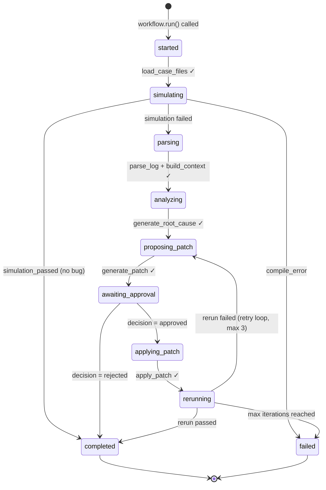
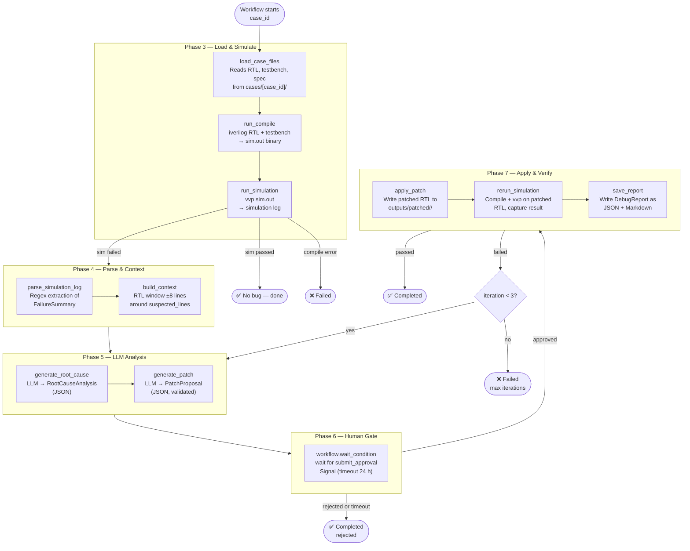
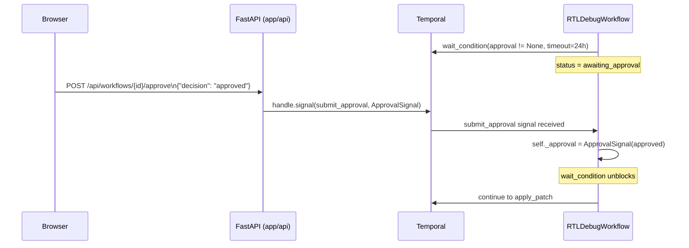
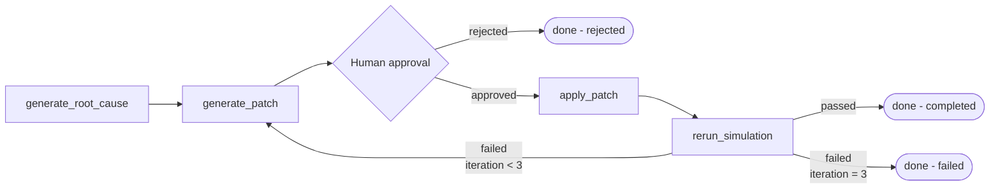
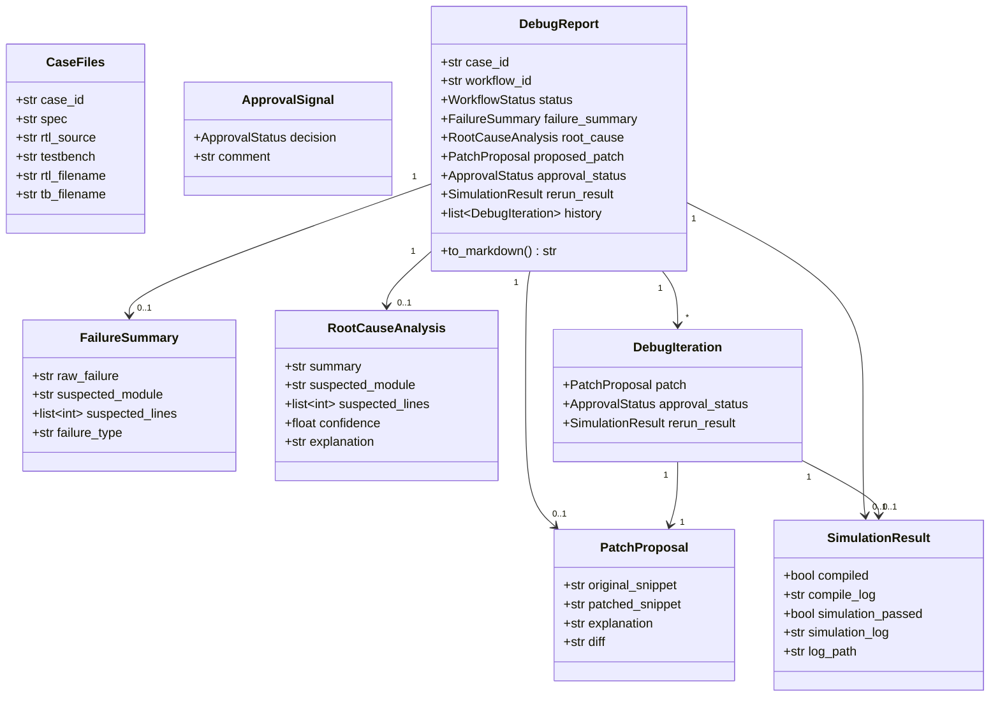
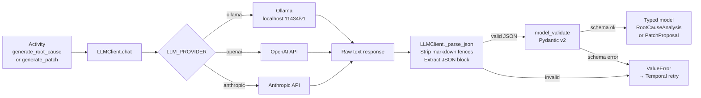

# Temporal Workflow Architecture

## Overview

The **Agentic RTL Debugger** uses [Temporal.io](https://temporal.io) as its orchestration backbone. Every step in the debug pipeline — from loading RTL source files to saving the final report — runs as a **durable Temporal Activity** orchestrated by a single **Temporal Workflow** (`RTLDebugWorkflow`).

This document covers the internal design of the Temporal layer in detail: workflow structure, activity pipeline, signals, queries, state machine, retry strategy, and the human-in-the-loop gate.

---

## Core design principle

Temporal requires a strict separation between **deterministic orchestration** (workflow code) and **non-deterministic side effects** (activity code):

| Layer      | File                | Responsibility                                                                                                              |
| ---------- | ------------------- | --------------------------------------------------------------------------------------------------------------------------- |
| Workflow   | `app/workflows.py`  | Pure orchestration: sequence activities, manage state, handle signals and queries. **No I/O, no LLM calls, no subprocess.** |
| Activities | `app/activities.py` | All side effects: filesystem, `iverilog`/`vvp` subprocesses, LLM API calls, log writes.                                     |

This separation is mandatory because Temporal **replays workflow history** to resume execution safely after a crash or worker restart. Any non-deterministic operation inside the workflow would produce different results on replay, corrupting the execution state.

---

## Workflow state machine



`WorkflowStatus` enum is defined in [`app/models.py`](../app/models.py).

---

## Full activity pipeline



---

## Activity reference

All activities are defined in [`app/activities.py`](../app/activities.py) and decorated with `@activity.defn`.

### Phase 3 — File loading & simulation

#### `load_case_files(case_id: str) → CaseFiles`

- Delegates to [`tools/file_reader.py`](../tools/file_reader.py) `load_case()`.
- Reads `cases/<case_id>/*.v` (RTL and testbench) and `cases/<case_id>/spec.md`.
- Returns a fully populated `CaseFiles` Pydantic model.

#### `run_compile(case_files: CaseFiles) → SimulationResult`

- Invokes `iverilog` via [`tools/simulation.py`](../tools/simulation.py) `compile_verilog()`.
- Writes compile log to `outputs/logs/<case_id>_compile.log`.
- Returns `SimulationResult(compiled=True/False, compile_log=...)`.

#### `run_simulation(case_files: CaseFiles) → SimulationResult`

- Invokes `vvp` via `run_vvp()` on the compiled binary at `$TMPDIR/rtl_debugger/<case_id>/sim.out`.
- Writes simulation log to `outputs/logs/<case_id>_simulation.log`.
- Returns `SimulationResult(simulation_passed=True/False, simulation_log=...)`.

### Phase 4 — Failure parsing & context

#### `parse_simulation_log(sim_result: SimulationResult) → FailureSummary`

- Delegates to [`app/log_parser.py`](../app/log_parser.py) `parse_log()`.
- Uses regex patterns to extract `suspected_module`, `suspected_lines`, and `failure_type` from `vvp` output.

#### `build_context(args: tuple[CaseFiles, FailureSummary]) → str`

- Delegates to [`app/context_builder.py`](../app/context_builder.py) `build_context()`.
- Extracts a ±8-line window around `suspected_lines` from the RTL source.
- Falls back to the full RTL source if no lines were identified.

### Phase 5 — LLM integration

#### `generate_root_cause(args: tuple[CaseFiles, FailureSummary, str]) → RootCauseAnalysis`

- Calls [`app/llm_client.py`](../app/llm_client.py) `LLMClient.chat()` with the `root_cause_prompt` template from [`app/prompts.py`](../app/prompts.py).
- Parses JSON output (handles markdown fences, leading prose) via `LLMClient._parse_json()`.
- Validates into `RootCauseAnalysis` via `model_validate()` — validation errors are `ValueError` and trigger Temporal retry.

#### `generate_patch(args: tuple[CaseFiles, RootCauseAnalysis, SimulationResult, PatchProposal | None, str]) → PatchProposal`

- Calls LLM with `patch_proposal_prompt` template.
- Accepts `prev_patch` and `rerun_log` so the model can learn from failed prior attempts.
- Pre-validates the patch by attempting to apply it via [`app/patcher.py`](../app/patcher.py) — if it fails, raises `ValueError` to trigger retry.
- Computes a unified diff via [`tools/diff_utils.py`](../tools/diff_utils.py) and stores it in `PatchProposal.diff`.

### Phase 7 — Patch application & verification

#### `apply_patch(args: tuple[CaseFiles, PatchProposal]) → None`

- Applies `PatchProposal.original_snippet → patched_snippet` via `str.replace` in `app/patcher.py`.
- Writes the patched RTL to `outputs/patched/<case_id>/<rtl_filename>`.

#### `rerun_simulation(case_files: CaseFiles) → SimulationResult`

- Compiles the patched RTL (from `outputs/patched/`) with the **original testbench** (from `cases/`).
- Writes logs to `outputs/logs/<case_id>_patch_compile.log` and `..._patch_simulation.log`.

#### `save_report(report: DebugReport) → None`

- Serialises the `DebugReport` to JSON via `model_dump_json()`.
- Renders a Markdown summary via `DebugReport.to_markdown()` (defined in `app/models.py`).
- Writes both to `outputs/reports/<case_id>_report.{json,md}`.

---

## Signal and query handlers

Defined in [`app/workflows.py`](../app/workflows.py) on `RTLDebugWorkflow`.



### Signal — `submit_approval`

```python
# app/workflows.py:69
@workflow.signal
async def submit_approval(self, signal: ApprovalSignal) -> None:
    self._approval = signal
```

Sets `self._approval`; the `wait_condition` lambda `lambda: self._approval is not None` immediately becomes `True`, unblocking the workflow without any polling or sleep loop.

### Query — `get_status`

```python
# app/workflows.py:79
@workflow.query
def get_status(self) -> str:
    return self._status.value
```

Read-only, returns the current `WorkflowStatus` value string. Used by the API's SSE stream and status endpoint.

### Query — `get_report`

```python
# app/workflows.py:83
@workflow.query
def get_report(self) -> Optional[dict]:
    return self._report.model_dump() if self._report else None
```

Returns the live `DebugReport` as a dict — progressively populated during execution.

---

## Human-in-the-loop gate

The key design decision: **an LLM-generated patch is never applied automatically**.

```python
# app/workflows.py:251-254
await workflow.wait_condition(
    lambda: self._approval is not None,
    timeout=timedelta(hours=24),
)
```

- The workflow **pauses durably** — no thread is blocked, no compute is consumed.
- Temporal persists the workflow state in its event history; the worker can be restarted and the workflow resumes from exactly this point.
- A 24-hour timeout ensures the workflow does not hang indefinitely; on timeout `self._approval` remains `None`, treated as a rejection.

---

## Agentic retry loop



The patch-generate → approve → apply → verify cycle is wrapped in a `for iteration in range(max_iterations)` loop (max 3, `app/workflows.py:210`). On each failed rerun, the previous `PatchProposal` and the rerun log are fed back to `generate_patch` so the LLM can reason about why the prior patch did not work.

---

## Retry policy

All activities use a shared `_DEFAULT_RETRY` policy defined at the top of `app/workflows.py`:

```python
# app/workflows.py:47-52
_DEFAULT_RETRY = RetryPolicy(
    initial_interval=timedelta(seconds=5),
    backoff_coefficient=2.0,
    maximum_interval=timedelta(minutes=2),
    maximum_attempts=3,
)
```

LLM activities (`generate_root_cause`, `generate_patch`) rely on this retry policy to handle JSON parse failures, model timeouts, and transient network errors. Invalid model output raises `ValueError` / `ValidationError`, which Temporal classifies as a retryable error.

---

## Data model reference

All Pydantic v2 models are in [`app/models.py`](../app/models.py).



---

## Temporal event history walkthrough (counter_bug)

Below is the approximate event sequence for a successful `counter_bug` run:

| Event | Type                                | Description                              |
| ----- | ----------------------------------- | ---------------------------------------- |
| 1     | WorkflowExecutionStarted            | `RTLDebugWorkflow.run("counter_bug")`    |
| 2-5   | ActivityScheduled/Started/Completed | `load_case_files`                        |
| 6-9   | ActivityScheduled/Started/Completed | `run_compile`                            |
| 10-13 | ActivityScheduled/Started/Completed | `run_simulation` → fails                 |
| 14-17 | ActivityScheduled/Started/Completed | `parse_simulation_log`                   |
| 18-21 | ActivityScheduled/Started/Completed | `build_context`                          |
| 22-25 | ActivityScheduled/Started/Completed | `generate_root_cause` (LLM call)         |
| 26-29 | ActivityScheduled/Started/Completed | `generate_patch` (LLM call)              |
| 30    | TimerStarted                        | 24-hour approval timer starts            |
| 31    | WorkflowExecutionSignaled           | `submit_approval { decision: approved }` |
| 32    | TimerCanceled                       | Timer cancelled on signal receipt        |
| 33-36 | ActivityScheduled/Started/Completed | `apply_patch`                            |
| 37-40 | ActivityScheduled/Started/Completed | `rerun_simulation` → passes              |
| 41-44 | ActivityScheduled/Started/Completed | `save_report`                            |
| 45    | WorkflowExecutionCompleted          | `simulation_passed: true`                |

You can access the full event history using the:

- [Temporal web UI](http://localhost:8233)
- [Temporal CLI](https://docs.temporal.io/cli)

---

## LLM integration internals



`LLMClient` lives in [`app/llm_client.py`](../app/llm_client.py). Provider selection and model name come from environment variables (`LLM_PROVIDER`, `LLM_MODEL`). The OpenAI-compatible client is used for Ollama, so no special adapter is needed.

---

## Worker registration

[`run_worker.py`](../run_worker.py) connects to the Temporal server and registers both the workflow class and all activity functions:

```python
worker = Worker(
    client,
    task_queue=config.task_queue,        # "rtl-debug-queue"
    workflows=[RTLDebugWorkflow],
    activities=[
        load_case_files, run_compile, run_simulation,
        parse_simulation_log, build_context,
        generate_root_cause, generate_patch,
        apply_patch, rerun_simulation, save_report,
    ],
)
```

The worker polls the `rtl-debug-queue` task queue on the Temporal server. Multiple workers can be run in parallel for horizontal scaling.
