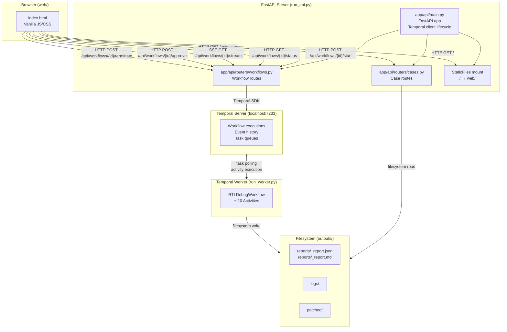
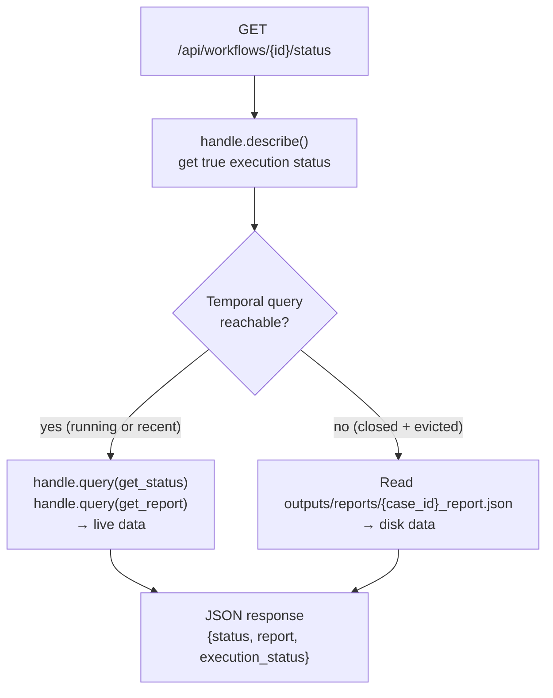
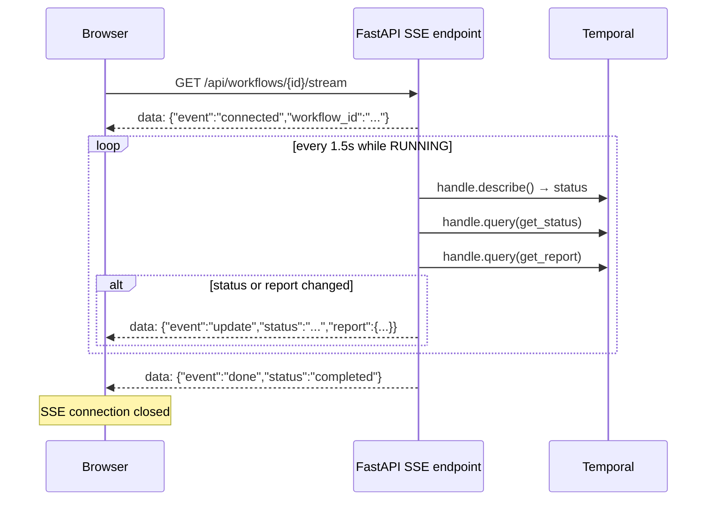
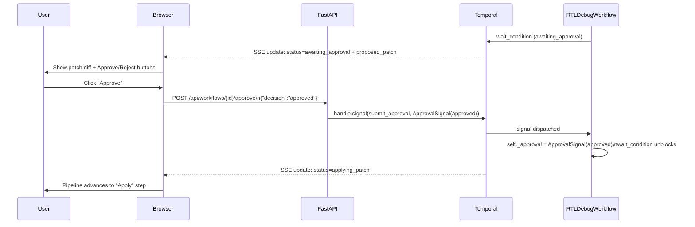

# Web & API Architecture

## Overview

The web layer is a thin bridge between the browser and the Temporal server. It has no workflow logic of its own — it only translates HTTP requests into Temporal SDK calls (workflow start, query, signal) and streams live status updates back to the browser via Server-Sent Events (SSE).

> **Note**: The browser UI (`web/`) was entirely **vibe-coded** (AI-assisted rapid prototyping) and is not the focus of the project. It exists to make the demo approachable. All interesting engineering lives in the Temporal workflow layer (see [`architecture.md`](architecture.md)).

---

## High-level component diagram



---

## FastAPI server

Entry point: [`app/api/main.py`](../app/api/main.py)

```python
app = FastAPI(title="Agentic RTL Debugger", version="1.0.0", lifespan=lifespan)
```

### Temporal client lifecycle

A single shared `temporalio.client.Client` is created at startup and reused across all requests:

```python
# app/api/main.py:37-43
@asynccontextmanager
async def lifespan(app: FastAPI):
    global temporal_client
    temporal_client = await Client.connect(config.temporal_host)
    yield
```

`get_client()` is the dependency injected (or directly called) by all route handlers that need to talk to Temporal.

### Static file serving

The compiled web UI is served from `web/` at the root path:

```python
# app/api/main.py:59-61
app.mount("/", StaticFiles(directory=str(_WEB_DIR), html=True), name="web")
```

Because the mount is registered **after** the API routers, `/api/*` routes take precedence over the static mount.

---

## API endpoints

### Cases router — `app/api/routers/cases.py`

Base prefix: `/api/cases`

| Method | Path | Description |
|---|---|---|
| `GET` | `/api/cases` | List all available debug cases with metadata (description, file list, last report status) |
| `GET` | `/api/cases/{case_id}` | Full case metadata + all RTL source file contents |
| `GET` | `/api/cases/{case_id}/report` | Last saved debug report (JSON) for the given case |

Case metadata is assembled from:
- `cases/<case_id>/spec.md` → description (extracted from `## Description` heading)
- `cases/<case_id>/*.v` → RTL and testbench file names
- `outputs/reports/<case_id>_report.json` → last run status (if available)

### Workflows router — `app/api/routers/workflows.py`

Base prefix: `/api/workflows`

| Method | Path | Description |
|---|---|---|
| `GET` | `/api/workflows` | List all `RTLDebugWorkflow` executions (running + recent closed) |
| `POST` | `/api/workflows/{case_id}/start` | Start a new workflow execution for `case_id` |
| `GET` | `/api/workflows/{workflow_id}/status` | Query current status + partial report |
| `GET` | `/api/workflows/{workflow_id}/stream` | SSE stream of status + report updates |
| `POST` | `/api/workflows/{workflow_id}/approve` | Send `submit_approval` signal (approve/reject) |
| `POST` | `/api/workflows/{workflow_id}/terminate` | Terminate a running workflow |

Workflow IDs are deterministic: `rtl-debug-{case_id}` (e.g. `rtl-debug-counter_bug`).

---

## Status endpoint — live vs closed workflows

The `/status` endpoint handles two cases transparently:



Temporal retains event history for completed workflows (configurable retention period, default 1–7 days), so `query()` works on recently closed workflows too. For very old runs the fallback reads the persisted report from disk.

---

## SSE stream

The `/stream` endpoint pushes live updates to the browser every 1.5 seconds while the workflow is running.



**SSE event types:**

| Event | When | Payload fields |
|---|---|---|
| `connected` | On stream open | `workflow_id` |
| `update` | Status or report changed | `status`, `report`, `execution_status` |
| `done` | Workflow is no longer RUNNING | `status` |
| `error` | Temporal call fails | `detail` |

The browser-side JS (`web/assets/app.js`) consumes these events to update the pipeline progress bar, report cards, and approval UI in real time.

---

## Approval flow — end-to-end



The approval request body is validated by `ApprovalRequest`:
```python
class ApprovalRequest(BaseModel):
    decision: str  # "approved" | "rejected"
    comment: str = ""
```

`decision` is coerced into `ApprovalStatus` enum; an invalid value returns HTTP 400.

---

## Browser UI structure

The single-page app (`web/index.html` + `web/assets/app.js`) has two views:

### Dashboard view
- Fetches `GET /api/cases` to populate case cards
- Fetches `GET /api/workflows` to populate the recent-runs table
- Each case card has a **Launch** button that posts to `/api/workflows/{case_id}/start` and navigates to the Live view

### Live Run view
- Opens an SSE connection to `/api/workflows/{id}/stream`
- Renders a pipeline progress bar (Load → Simulate → Parse → Analyze → Patch → Review → Apply → Verify → Done)
- Progressively reveals report cards as data arrives:
  - **Simulation Failure** card (raw log)
  - **Root Cause Analysis** card (confidence, summary, explanation)
  - **Proposed Patch** card (side-by-side original/patched + unified diff + approve/reject buttons)
  - **Rerun Result** card (pass/fail + log)
- Handles the terminated state with a banner

---

## Configuration

All server-side configuration is read from environment variables via [`app/config.py`](../app/config.py) using `python-dotenv`:

| Variable | Default | Description |
|---|---|---|
| `TEMPORAL_HOST` | `localhost:7233` | Temporal server address |
| `TEMPORAL_NAMESPACE` | `default` | Temporal namespace |
| `TEMPORAL_TASK_QUEUE` | `rtl-debug-queue` | Task queue name |
| `CASES_DIR` | `cases` | Root directory for debug cases |
| `OUTPUTS_DIR` | `outputs` | Root directory for runtime artefacts |

---

## Running the API server

```bash
# Standard start
python run_api.py

# Or with uvicorn directly (auto-reload for development)
uvicorn app.api.main:app --reload --port 8000
```

The API server connects to the Temporal server on startup. If Temporal is not reachable, the server starts but all workflow routes will return errors until Temporal becomes available.
